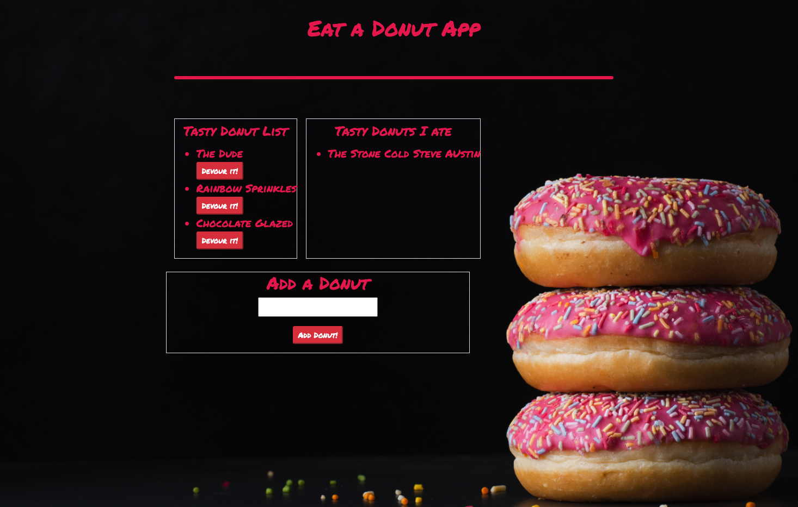

# Eat a Donut App
  
## License
  

## Description

Eat a Donut is an application developed using node.js, handlebars, jquery, express, mysql. The application uses a database with seed files and displays donuts to the users. The user can then eat a donut and the donut will go to the eaten list. The user can also add a donut. On the backend the application works using api routes get, push and put. The user is able to click on a fuction using on click and submit. The sql queries run through an orm one for each of the seperate functions, select all donuts, insert a donut and update a donut. There is also a public file that the javascript and css are running through. I also spent some time on the css designing the website to look and function well. Attached is a link to the deployed app. <a href="https://eatthedonutapp.herokuapp.com/">Eat a Donut</a> 

# Questions
If you have any questions about the repo, open an issue or contact me directly at magoldstein93@gmail.com. You can find more of my work on my GitHub maxgoldstein93.